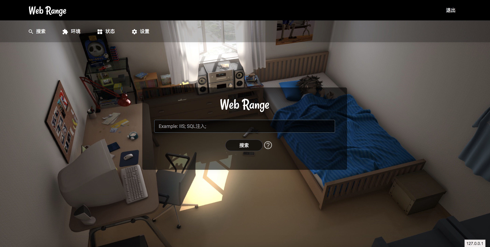
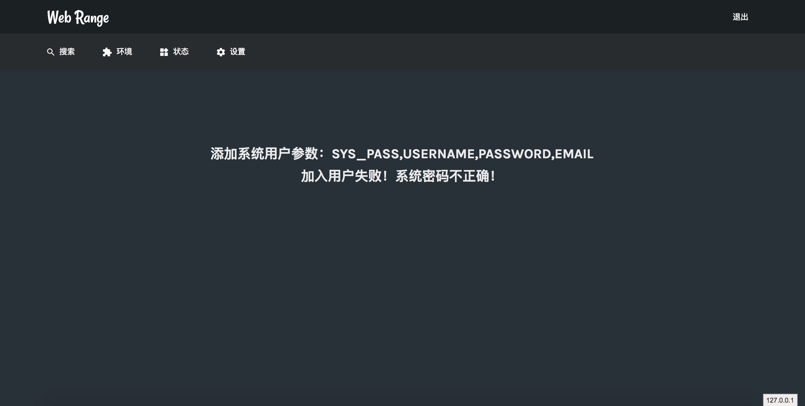
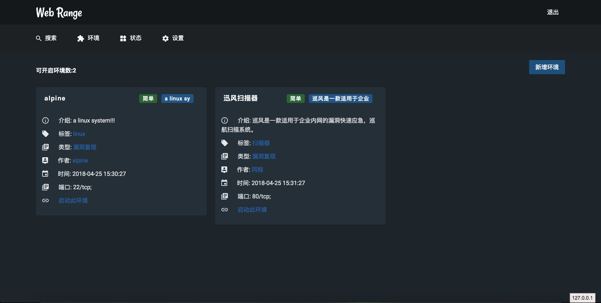
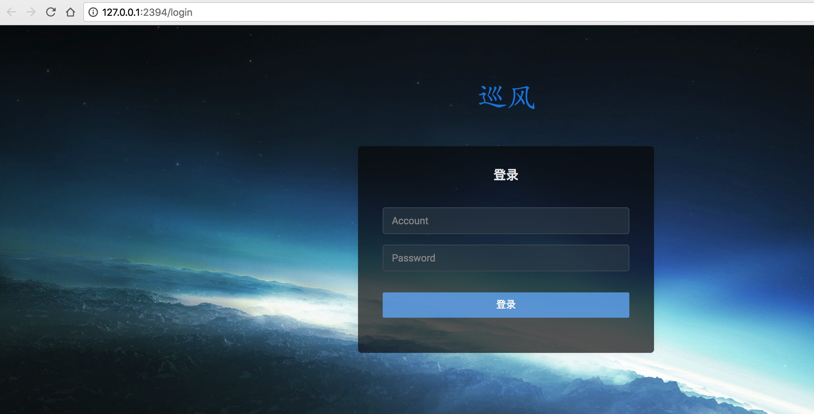
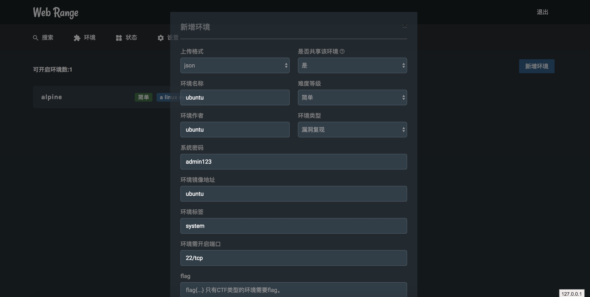
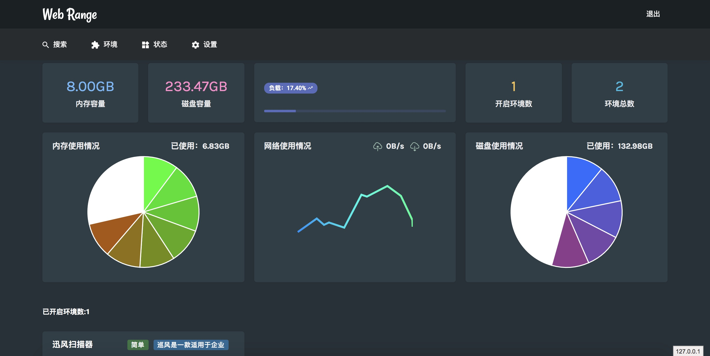

# VulnMatrix
* A Cybersecurity Testing and Verification Range Platform

* 一个Web靶场平台，可以导入各种Docker漏洞场景和Ctf场景。可以用来部署在私人、公有网络中，以供练习使用。

核心功能设计：

1. 根据docker-compose，生成靶场

2. 点击生成的靶场弹出新的页面，具有两个视角：

   - 攻击者视角：有一个shell和工具箱；
   - 防御者视角：有目标网络的拓扑……

3. 用户管理

# 鸣谢
* 先感谢伟大的开源社区，让这个小网站可以顺利完成。

* 使用web框架[tornado](http://www.tornadoweb.org/en/stable/)（感谢），web页面使用[xunfeng](https://github.com/ysrc/xunfeng)前端界面（感谢ysrc，已征得同意使用），后端使用[docker](https://github.com/docker/docker-py)模块作为核心（感谢），感谢[docker](https://docker.com)虚拟化平台，感谢所有在项目中用到的优秀模块，感谢在网络中分享优秀代码的大佬。

# 系统环境

> python版本：3.6
>
> tornado版本：5.0
>
> 操作系统版本：ubuntu16.04+
>
> Docker版本：18.03.0-ce-mac60 (23751)（2017年之后的版本）
>
> 数据库：sqlite3
>
>默认账户密码：admin/123456


# 环境配置

1、安装ubuntu系统16.04

2、clone项目

```sh 
git clone https://github.com/cleverbao/WebRange.git
```

3、安装python3.6

``` sh 
sudo apt install python3 python3-dev python3-pip   -y
```

4、安装依赖库

``` sh
cd web_range
pip install -r requirements.txt
```

5、安装最新版本的docker

``` sh
#! 安装步骤只适合Ubuntu16.04版本
#! 如果是其他版本参考https://docs.docker.com/engine/installation/linux/docker-ce/ubuntu/
sudo apt-get remove docker docker-engine docker.io
sudo apt-get update
sudo apt-get install \
    apt-transport-https \
    ca-certificates \
    curl \
    software-properties-common
curl -fsSL https://download.docker.com/linux/ubuntu/gpg | sudo apt-key add -
sudo apt-key fingerprint 0EBFCD88
sudo add-apt-repository \
   "deb [arch=amd64] https://download.docker.com/linux/ubuntu \
   $(lsb_release -cs) \
   stable"
sudo apt-get update
sudo apt-get install docker-ce
#! 如果使用非root用户运行docker，需要运行一下命令：
sudo groupadd docker
sudo gpasswd -a ${USER} docker
sudo service docker restart
```

6、安装sqlit3

``` sh
sudo apt install sqlite3 -y 
```

7、运行系统

``` sh
python3 run.py
```

8、使用supervisor开启守护进程(非必须)

``` sh
vim ./supervisor.conf
#! 修改配置项
#! 将‘directory = /root/WebRange’中’=‘后面的内容改为项目所在目录
#! 将‘user = root’中‘=’后面的内容，改为用来启动程序的用户
cp ./supervisor.conf /etc/supervisor/conf.d/WebRange.conf
sudo service supervisord restart
```

9、由于程序使用了websocket进行数据传输，因此如果需要使用nginx进行反向代理，可以参考使用以下配置文件

``` conf
server {
    listen 80;
    listen [::]:80;

    server_name localhost;
    error_page 404 = /404.html;

#   root /var/www/example.com;
#   index index.html;
    location /static/{
        alias /root/WebRange/static/; 
        expires 24h;
    }
    location / {
	proxy_pass_header Server;
        proxy_set_header X-Forwarded-For $proxy_add_x_forwarded_for;
	proxy_http_version 1.1;
	proxy_set_header Upgrade $http_upgrade;
	proxy_set_header Connection "upgrade";
	proxy_set_header Host $http_host;
    proxy_redirect off;
    proxy_set_header X-Real-IP $remote_addr;
	proxy_pass http://127.0.0.1:8000/;
    }
}
```


## 主要功能

* 提供Web界面，通过登陆用户，打开实验场景进行练习。

  

* 提供了接口进行添加用户，需要系统密码（可以在run.py中进行修改），/add_user?sys_pass=admin123&username=test&password=test&email=test@test.com

  

* 用户登陆后，可以搜索想要练习的场景关键字。

* 用户登陆后，可以在环境界面查看所有的实验场景，可以选择场景开启开启环境（由于docker的问题，开启web服务，第一次访问会403，刷新一下就可以了）。

  

* 实验场景开启后，会在当前主机随机映射端口，如果容器开启了80和8080端口，程序将会自动打开对应的Web页面。如果环境需要开启多个端口，可以在状态页面看到所有开启的端口信息，如果是web服务会自动生成链接，其他的端口会显示容器端口和主机映射端口。

  

* 在环境页面提供了新增环境的功能，可以通过填写数据新增环境，也可以直接上传文件新增环境。

* 增加环境时需要填写每一项的内容，环境分为ctf环境和漏洞复现环境，ctf环境需要加入flag（现阶段没有验证flag功能，后续版本会加入flag验证功能或ctf比赛功能）。

  

* 用户登陆后，可以在状态页面管理已经开启的环境。

  


* 在设置页面可以修改当前用户密码。

> 通过超级密码可以添加用户，添加场景，没有超级密码任何账户都没有权限操作。
>


# 操作视频


# 附加说明

> 本项目禁止作用于商业用途。
